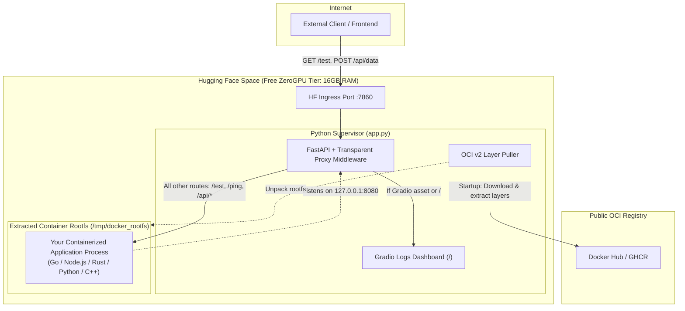

# 🐳 GradioSpaces: Daemonless Docker Runner on Free Hugging Face Spaces

> **Run application processes from ANY Docker/OCI image (Go, Node.js, Rust, Python, C++, Java, etc.) completely FREE on Hugging Face Spaces without a Docker daemon.**

[](LICENSE)
[](https://huggingface.co/spaces)
[](https://hub.docker.com)
[](https://huggingface.co/docs/hub/spaces-gpus)
[](rules.md)

> [!IMPORTANT]
> **Before deploying, please review the [Deployment Rules & Safety Guidelines](rules.md).**  
> Learn how to prevent automated account lockouts, why external binary downloads are prohibited, and critical differences between **Public** vs. **Private** Spaces (including why Private Spaces cannot be called directly from frontend browsers).

---

## 💡 Why This Repository Exists

### The Opportunity: Generous Free Cloud Compute
Hugging Face Spaces provides high-performance container hardware on its free tier:
- **Up to 16 GB to 50 GB RAM** allocated per container (16 GB on CPU Basic, up to 50 GB on ZeroGPU tier)
- **Up to 2 to 8 vCPUs** dedicated compute
- **50 GB Temporary Disk Storage** (ephemeral storage for container rootfs and runtime data)
- **Dynamic ZeroGPU Access** (NVIDIA A10G / L4 GPUs available on demand at no cost)

### The Problem: The Docker Space Paywall
Hugging Face officially offers a Docker Space SDK (`sdk: docker`). However, native Docker Spaces are **locked behind a paid PRO subscription** ($9/month minimum). If you attempt to create or deploy a Docker Space on the free tier, the API rejects it with:
```
402 Payment Required: Docker spaces require a Pro subscription
```
Free tier users are restricted to **Gradio** or **Streamlit** SDKs, which are traditionally designed to only run single-file Python UI demos.

### The Breakthrough
**GradioSpaces removes this limitation entirely.** 

By leveraging an unprivileged user-space OCI layer puller and a transparent FastAPI reverse proxy, this project acts as a **daemonless runner**: it pulls public Docker/OCI images, unpacks their rootfs, and executes their application processes natively inside a 100% free Hugging Face Gradio Space—no Docker daemon (`dockerd`) or container runtime required.

---

## 🧠 Gradio & HF Constraints: How We Solved Them

| Hugging Face Constraint | Why It Happens | How We Solved It in `app.py` |
| :--- | :--- | :--- |
| **No Docker Daemon (`dockerd`)** | Free Spaces run inside locked-down, unprivileged Kubernetes pods without `/var/run/docker.sock`. Running `docker run` is impossible. | **Daemonless OCI v2 Puller:** Queries the Docker Hub / GHCR v2 registry API, downloads the `linux/amd64` layer blobs over HTTPS, and unpacks them directly into `/tmp/docker_rootfs` using pure Python `tarfile`. The application process is then executed natively via standard process execution without requiring `dockerd` or a container engine. |
| **Gradio 5/6 SSR Process Crash** | Newer Gradio versions spawn an internal Node.js Server-Side Rendering (SSR) proxy that hangs or crashes in cloud containers (`Stopping Node.js server...`). | **SSR Bypass Monkeypatch:** Automatically patches `gr.Blocks.launch` at runtime to force `ssr_mode = False`. |
| **ZeroGPU Supervisor Abort** | ZeroGPU environments verify that the space is an authentic GPU application during startup. If no `@spaces.GPU` decorator is detected in the AST, the container terminates. | **ZeroGPU AST Probe:** Injects a lightweight `@spaces.GPU` handler that satisfies the platform supervisor check. |
| **Port 7860 Isolation** | Hugging Face exclusively exposes public traffic on port `7860`. Services listening on internal port `8080`, `3000`, etc. are inaccessible from outside. | **Transparent Reverse Proxy Middleware:** Intercepts traffic on port `7860` and forwards requests to `http://127.0.0.1:INTERNAL_PORT` using high-performance asynchronous `httpx`. |
| **Prefix-Free URL Routing** | Gradio natively captures routes or throws 404 for arbitrary endpoints like `/test`, `/login`, or `/users`. | **HTTP 404 Fallback Proxy:** Any route that is not a Gradio internal asset (`/assets`, `/gradio_api`) is automatically forwarded to your application process untouched. Calling `{base_url}/test` hits `/test` directly on your backend service! |

---

## 🏗️ Architecture



---

## 🚀 Setup Guide (5 Minutes)

You can run an application written in **any programming language**.

### Step 1: Build & Push Your Docker Image
Create your application in your preferred language and write a standard `Dockerfile`:

```dockerfile
# Example: Multi-stage build for Go, Node.js, Rust, Python, etc.
FROM golang:alpine AS builder
WORKDIR /app
COPY . .
RUN CGO_ENABLED=0 GOOS=linux GOARCH=amd64 go build -o /app/server .

FROM alpine:latest
WORKDIR /app
COPY --from=builder /app/server /app/server
EXPOSE 8080
CMD ["/app/server"]
```

Build and push it to **Docker Hub** or **GitHub Container Registry (GHCR)** as a **public** image:
```bash
docker build -t your-username/my-docker-app:latest .
docker push your-username/my-docker-app:latest
```

---

### Step 2: Create a Free Hugging Face Space
1. Go to [Hugging Face Spaces](https://huggingface.co/new-space).
2. Choose **Space SDK: Gradio**.
3. Choose **Hardware: ZeroGPU (Free)** or **CPU Basic (Free 16GB RAM)**.
4. Set Space visibility to **Public** (or Private).

---

### Step 3: Copy `app.py` & `requirements.txt`
In your cloned Hugging Face Space repository, add:
1. [`app.py`](app.py)
2. [`requirements.txt`](requirements.txt)

---

### Step 4: Configure Your Image & Port
Open `app.py` and set your image and port (lines 34–37):

```python
# 1. Target Docker image on Docker Hub or GHCR (must be public):
DOCKER_IMAGE = os.getenv("DOCKER_IMAGE", "your-username/my-docker-app:latest")

# 2. Internal port your application listens on inside the container:
INTERNAL_PORT = int(os.getenv("INTERNAL_PORT", "8080"))

# 3. (Optional) Custom command to run. Leave empty to auto-detect binary:
ENTRYPOINT_CMD = os.getenv("ENTRYPOINT_CMD", "")
```

> **Tip:** You can also configure these dynamically in **Settings $\rightarrow$ Variables and secrets** in your Hugging Face Space without editing code!

---

### Step 5: Commit and Deploy
```bash
git add app.py requirements.txt
git commit -m "Deploy universal container"
git push origin main
```

That's it! Hugging Face will start `app.py`, which pulls your image layers, extracts the rootfs, launches your binary on internal port `8080`, and forwards all traffic to it.

---

## 📡 Live Endpoints

Once deployed at `https://<your-space-name>.hf.space`:

| Route | Destination | Description |
| :--- | :--- | :--- |
| **`GET /`** | **Gradio Dashboard** | Live container supervisor logs, ZeroGPU status check, and hardware stats |
| **`ANY /<custom_path>`** | **Docker App** | Direct call to your container (e.g., `/test`, `/login`, `/users/42`, `/webhook`) |
| **`ANY /api/...`** | **Docker App** | Direct forwarding for all API subpaths |
| **`GET /__status`** | **Supervisor API** | Real-time JSON telemetry, pull status, memory stats, and container logs |
| **`GET /api/ram`** | **Hardware API** | Total host RAM, free RAM, available cores, and container backend status |

---

## ⏰ Keeping Your Space Always Awake (24/7 Uptime)

Free Hugging Face Spaces will automatically sleep (pause) if they do not receive incoming HTTP requests for an extended period.

To keep your application process running **24/7 without shutting down**, set up a free uptime ping service:

1. **Recommended Free Services:**
   - **[UptimeRobot](https://uptimerobot.com)** (Free 50 monitors, 5-minute pings)
   - **[Better Stack](https://betterstack.com)** (Free uptime and heartbeat monitoring)
   - **[cron-job.org](https://cron-job.org)** (Free scheduled web requests)
2. **Target Ping URL:**
   ```
   https://<your-space-name>.hf.space/ping
   ```
   *(or `https://<your-space-name>.hf.space/__status`)*
3. **Interval:** Set the monitor to ping every **5 to 10 minutes** (`HTTP GET`).

As long as regular pings are received, Hugging Face keeps your space active and running.

> **⚠️ Note on Ephemeral Storage:** The container disk provides **50 GB of temporary (ephemeral) storage**. If the space restarts or rebuilds, files stored locally in `/tmp` are reset. For persistent data, connect your app to an external database (e.g. Supabase, Neon, PostgreSQL, MongoDB Atlas, or S3/R2 object storage).

---

## 🛡️ Requirements File (`requirements.txt`)

```txt
gradio>=6.0.0
fastapi
uvicorn[standard]
httpx
psutil
spaces
```

---

## 📜 Deployment Rules & Safety Guidelines

Make sure to read the full [Rules & Guidelines (rules.md)](rules.md) before deploying your service:
- **Avoid Platform Bans:** Why downloading external runtime tools/binaries at boot triggers automated account lockouts.
- **Frontend / Browser Limitation:** Why Private Spaces require Bearer tokens and cannot be directly called from browser JavaScript (`fetch()`), and how to properly proxy private spaces through a backend.
- **Content Policy:** Requirements for testing content moderation or NSFW filtering models safely.

---

## 📄 License

This project is licensed under the [MIT License](LICENSE).
Feel free to use it, star it, and share it with the developer community!
